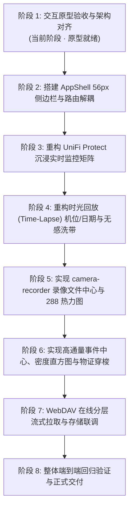

# zero-nvr · 前端重构详细执行方案 (v2.0 全面升级版)

> **核心重构愿景**：  
> 融合 **Ubiquiti UniFi Protect** 的旗舰级沉浸视觉与连续时光洗带体验，以及 **`camera-recorder`** 成熟好用的结构化录像文件管理与 WebDAV 归档运维能力，打造既有极致视效、又有硬核生产力工具的下一代专业 NVR 交互系统。

---

## 一、 核心痛点与系统交互层级规范 (Navigation Hierarchy)

在与用户的深入推演和反馈迭代中，确立了系统的两层纯粹交互模型，彻底解决**层级混淆与冗余按钮**问题：

```
┌──────────────────────────────────────────────────────────────────────────────┐
│  全局最高层级导航 (Global Rail): 56px 极致紧凑 Dock                          │
│  [📹 实时监控] [⏪ 时光回放] [📁 录像文件] [⚡ 智能事件] [📷 设备] [💾 存储] [⚙️ 运维] │
└──────┬───────────────────────────────────────────────────────────────────────┘
       │ 激活任意模块时，主工作区顶部栏 100% 专注该视图的专属业务操作：
       ▼
┌──────────────────────────────────────────────────────────────────────────────┐
│ 1. 时光回放顶部栏: [● 时光回放] [🟢 机位选择下拉 ▾] [‹ 2026-09-28 ▾ ›] [🛡️ 加锁] [✂️ 剪辑] │
│ 2. 文件中心顶部栏: [● 录像文件中心] [机位: ▾] [日期: ▾] [展开月历] [状态筛选] [⟳ 刷新]    │
│ 3. 事件告警顶部栏: [● 事件中心] [实体分类胶囊] [搜索框] [24H密度直方图] [批量操作]       │
└──────────────────────────────────────────────────────────────────────────────┘
```

- **严格分离职责**：
  - **左侧 56px Dock 侧边栏**：系统全局唯一的视图调度中心，1键在 `Live View`、`Time-Lapse`、`Files`、`Detections` 等大模块之间穿梭，高亮指示当前状态；
  - **各主界面顶部栏**：彻底剔除 “返回实时”、“时光/文件切换” 等与侧边栏冲突的冗余控件，空间完全释放给**当前视图的核心业务操作**。

---

## 二、 七大核心业务工作区深度设计规格

### 0. 沉浸式多路实时安防矩阵与巡视控制台 (Live Monitoring & Matrix Console)
*深度挖掘 `LiveView.vue`、`LiveCameraTile.vue` 与 specs 0011/0018 的生产级能力，彻底达到 UniFi Protect 工业级标杆：*

- **灵活的分屏布局与预案管理 (Layout Presets & Matrix Views)**：
  - **多规格网格矩阵**：支持 `1`、`4`、`1+5 主从`、`9`、`16` 格式一键无缝重排，CSS Grid 硬件加速；
  - **分屏预案选择器 (View Presets Popover)**：内置预案快速切换（全区巡视 6机、重点出入口 4机、夜间安防周界 1+5、单机全屏巡视 1机），支持一键「设为启动默认预案」与「新建预案向导」；
- **智能网络码流自适应调度 (Adaptive Network Quality Switching)**：
  - **智能自适应 (Auto)**：前端监控下行带宽与丢包率，蜂窝移动端或弱网环境下自动将分屏平滑降级为 720P 子码流，网络通畅或单机放大时秒级升回 4K/2K 超高清主码流；
  - **强制主/子码流**：提供「强制 4K/2K 主码流」与「强制 720P 低延迟子码流」一键切换，兼顾画质与带宽消耗；
- **全机位交互式 Action HUD (6 路独立沉浸控制浮层)**：
  - **双击/按钮单机聚焦 (Tile Focus Zoom)**：支持双击任一画面或点击悬停 HUD 放大为全屏单机巡视，顶部药丸动态显示「退出单机聚焦 (0X机位)」；
  - **手动事件录像触发器 (Manual Recording with 10s Prebuffer)**：对接后端 `createRecordingTrigger`，触发时自动将 tmpfs 中前置 10 秒环形预录无缝合并入事件切片并永久锁存，画面浮动展示红色心跳徽标与实时秒级计时器；
  - **4K 原始快照抓拍 (4K Snapshot)**：一键捕获当前机位高保真全分辨率截图，自动生成物证附件；
  - **高保真音频监听 (Live Audio Listen)**：一键开启机位麦克风拾音监听与静音切换；
  - **时光回放穿梭 (Jump to Time-Lapse)**：一键携带当前机位时标直通 Time-Lapse 进行无缝洗带回查；
- **专业级 PTZ 云台与变倍控制台 (ONVIF PTZ Console)**：
  - **8 向连续微调摇杆 (8-Way D-Pad)**：支持 ↖ ▲ ↗ ◀ ⌂ ▶ ↙ ▼ ↘ 连续平移与俯仰，长按连续移动，松开即刻停止；
  - **光学变倍与自适应对焦 (Optical Zoom & AF)**：`+ 放大`、`- 缩小` 精细变倍，支持近焦、远焦及 AF 自动对焦触发；
  - **多档速度控制 (Pan/Tilt Speed)**：1~10 档平滑调速（微调慢速、平滑中速、高速巡检）；
  - **预置位槽位管理 (Presets Management)**：4 组物理预置位（门禁、前台、电梯厅、通道）一键高速调用与当前坐标覆盖保存；
  - **全区预置位守卫巡航 (Guard Tour Cruise)**：自动在各预置位间循环巡视（每位驻留 15 秒）。
- **底层媒体与网络诊断浮层 (WebRTC Live Telemetry HUD)**：
  - 实时毫秒级延迟（14ms）、FPS、分辨率、码率、H.265 硬解状态与 ICE 连接通道诊断。

---

### 1. 时光回放工作区 (Time-Lapse Surveillance Workspace)
- **UniFi Protect 沉浸式视界**：
  - 单机位 4K/2K 全屏沉浸画面 + 左上角 OSD 毫秒级时间水印；
  - 底部连续 24 小时无感时间轴（支持 `0.5x` ~ `8x` 变速洗带、鼠标滚轮缩放、单击精确定位）；
  - **智能目标气泡 (Smart Pins)**：时间轴上方浮动展示人、车识别事件图标，点击秒级对齐事件关键帧；
  - **剪刀剪辑选区 (Scissors Clip)**：直观拖动起止滑块，一键 Direct Copy 无损合并导出 MP4。
- **机位与日期快速选择器**：
  - **机位下拉胶囊**：顶部醒目标注当前摄像机与在线状态，展开展示所有机位（带 4K/2K/1080P 与帧率指标），点击秒级切机；
  - **日期单日步进与日历弹层**：
    - `‹`（前一天）与 `›`（后一天）快速步进（未来日期防误触自动禁用）；
    - 日历 Popover：原生日期选择器 + 「今天/昨天」快捷标签 + **近期有录像天数列表（带段数提示，如 09-28: 96段）**，彻底避免盲目切到空白日期；
    - 画面水印、时间轴刻度栏、文件中心全局三方数据联动同步。
- **WebDAV 在线分层“前端无感直拉”**：
  - 本地录制完成后通过 WebDAV（OpenList/Alist/NAS）自动归档；
  - 前端时间轴完全抹平本地存储与 WebDAV 的差异，统一呈现为连续色带；
  - 拖拽回放时后端通过 HTTP Range 边下边播，实现零等待流式直拉。

---

### 2. 录像文件管理中心 (Structured Files & Archive Manager)
*深度吸收 `camera-recorder` 的高生产力实践，补齐纯时间轴无法精细化运维的短板：*

- **24 小时 288 格录像覆盖热力图 (288-Cell Heatmap)**：
  - 全天划分为 24 列 × 12 行（每格 5 分钟），`.heat-grid-24` 完美栅格排布；
  - 具备分钟垂直轴（`:00`、`:15`、`:30`、`:45`、`:55`）与小时水平轴（`00:00` ~ `24:00`）；
  - 点击任一槽位即刻调取该切片并高亮对应表格行。
- **展开式 30 天月度日历分布矩阵 (Month Calendar)**：
  - 展开直观呈现当月每天录像覆盖度（完整/部分/缺失），点击单日立即加载该日切片列表。
- **切片事实检视器 (Segment Inspector)**：
  - 呈现精确起止时标、文件字节大小、实时码率、视频编码规格；
  - 原始切片播放画布，支持上一段/下一段自动续播；
  - 提供 **`[ ⏪ 跳转时光轴回放 ]`**，携带时间参数一键穿梭回 Time-Lapse 沉浸洗带；
  - **`[ ⬇️ 下载 Raw MP4 ]`**：直接下载原始切片裸流，无需转码；
  - **`[ 🛡️ 加锁保护 ]`**：标记关键切片永久免除磁盘高水位（85%/95%）轮转清理。
- **高密度数据表格与批量操作条**：
  - 结构化表格清晰标识存储层（`⚡ 本地 NVMe`、`☁️ WebDAV 在线`、`🔄 双副本`）；
  - 批量操作工具栏：批量导出打包、批量加锁保护、批量推送 WebDAV、批量清理。

---

### 3. 高通量事件与告警处理中心 (High-Throughput Detections Center)
*专门针对日均数百至数千条动检与智能识别事件的快速排查痛点设计：*

- **多维复合快速筛选工具栏**：
  - **实体分类快捷标签**：`全部 (1,284)` | `👤 人员 (842)` | `🚗 车辆 (312)` | `📦 包裹 (18)` | `🐾 动物 (42)` | `⚡ 动检 (70)` | `🚨 严重告警 (3)` | `🛡️ 已加锁 (15)`；
  - **全文智能搜索**：即时检索车牌号（如 `粤B·88921`）、人员属性（`未戴安全帽`、`背包`）或机位名称；
  - **复合下拉筛选**：机位（6路）+ 时段（今天/近1h/近6h/昨天/近7天）+ 级别（严重/警告/提示）+ 处理状态（待处理/已确认）；
  - **一键重置筛选**。
- **24 小时事件密度直方图 (Hourly Histogram)**：
  - 24 根可视化高度柱状图实时呈现全天各小时事件峰值分布；
  - **点击任意小时柱体**，列表瞬间收敛聚焦至该 1 小时内事件（如 `14:00~14:59`），再次点击取消。
- **双排查视图自由切换**：
  - **🎴 卡片网格视图 (Grid View)**：大图缩略卡片，展示清晰 AI Bounding Box 目标高亮框、置信度徽章（`99.4%`）、持续时长与快速操作；
  - **📋 密集清单表格视图 (Table View)**：高密度审计表格，支持复选多选。
- **右侧物证详情抽屉 (Forensic Evidence Inspector)**：
  - 4K 高清快照 + AI 目标检测框高亮；
  - **15 秒关键帧视频循环就地预览**；
  - **极其关键的联动**：点击 **`[ ⏪ 跳转时光轴精准回放 ]`**，直接跳转至 Time-Lapse 对应机位与精确秒数，调取完整上下文；
  - 物证事实列表（事件 ID、机位、触发算法、WebDAV 归档校验哈希）；
  - 处置操作：永久加锁保护、标记已确认、下载 MP4、下载 WebP 原图、录入巡检处置备注；
- **批量处置条**：支持批量确认 (Acknowledge)、批量加锁、批量导出事件集。

---

### 4. 存储分层与多级自动留存工作区 (Storage & Retention Tiering)
*基于后端 `backend/app/modules/storage` 与 spec 0004/0005/0010 深度构建：*
- **存储节点管理 (Storage Targets)**：
  - **本地 NVMe 写入池**：多盘挂载、容量柱状图、3 阶核心高水位滑块控制（`80% 警戒通知`、`85% 触发自动清理已归档切片`、`95% 极值熔断降频`）、多盘平滑切换；
  - **WebDAV 在线存储池**：在线状态监测、延迟遥测（28ms）、流式拉取带宽测试（92 MB/s）、密码与安全配置。
- **多级留存策略 (Retention Policies)**：
  - **作用域支持**：`GLOBAL (全局)`、`CAMERA_GROUP (机位组)`、`CAMERA (单机位)` 细粒度定义；
  - **录像类型分类留存**：常规录像（默认 14 天）、事件录像（默认 30 天）、手动录像（默认 90 天）；
  - **双清理模式**：`BEST_EFFORT` (空间达到高水位时才清理) vs `HARD` (严格到期强制清除)；
  - **`requireArchive: true` 核心硬指标**：必须在 WebDAV 归档成功并经 SHA-256 哈希校验通过后，才允许物理删除本地切片；
  - **加锁保护永久豁免**：凡打上保护锁的切片自动免疫任何自动清理。

---

### 5. 机位设备全生命周期管理工作区 (Devices & Lifecycle Console)
*基于后端 `backend/app/modules/cameras` 与 spec 0018/0019 深度构建：*
- **自动发现与接入**：ONVIF WS-Discovery 局域网组播自动探测（239.255.255.250:3702），一键探寻并绑定摄像机；
- **多码流角色精确绑定 (Stream Profiles)**：
  - `RECORD`：主码流（4K/2K H.265 25fps），专属后端无损切片录制；
  - `PREVIEW`：子码流（720P 30fps），专属多路分屏实时超低延迟 WebRTC 直连；
  - `AI_DETECT`：识别码流（1080P），专属推送给 Frigate / Coral TPU 进行目标分析。
- **分组与运维状态**：机位区域分组（大堂/通道/机房）、**机位维护模式**、**退役归档状态 (Retired)**（机位下线但保留所有历史索引与录像）。
- **CSV 批量导入导出向导**：支持离线表格批量编辑后一次性导入，自动完成流探针校验。

---

### 6. 全功能企业级系统设置与运维工作区 (System & Settings Console)
*深度挖掘并完整继承 `frontend/src/views/SystemView.vue`、`backend/app/modules/system` 与 specs 0009/0011/0012/0014/0015/0016/0017 的全部生产级能力，彻底终结简陋设置：*

- **12 大核心配置管理子域（采用 UniFi OS 侧边抽屉式导航）：**
  1. **📊 系统概览与资源 (Overview)**：主机 CPU/RAM 实时利用率、NVMe I/O 水位、ZLMediaKit 进程健康（入流数、WHEP 直连数、丢包率）、数据库状态（SQLite WAL 尺寸 / 连接池）、系统 Uptime。
  2. **⚙️ 基础参数与网络 (General)**：NVR 主机名、对外 Web 服务 Base URL、WebRTC WHEP 穿透端口、系统时区 (UTC+8) 与语言。
  3. **🕒 时钟与 NTP 策略 (Time & NTP)**：上游 NTP 授时服务池 (`pool.ntp.org`)、**Managed NTP (NVR 统一下发校时)** vs **Camera-Clock** 模式选择、**全网摄像机时钟漂移 (Clock Drift) 毫秒级看板（大堂 +4ms、机动车道 -12ms）**，超过容差自动报警，一键全网校准。
  4. **👥 用户权限体系 (Users & RBAC)**：Admin（超级管理员）、Operator（操作员：回放/云台/加锁/确认告警，禁止修改系统配置）、Viewer（值班员：仅分屏实时预览），多用户密码重置与二要素认证。
  5. **🔑 API 服务集成令牌 (API Tokens)**：供 Home Assistant、自动化备份与监控脚本集成，具备细粒度 Scopes（`cameras:read`、`recordings:read`、`ptz:write` 等）及自动过期与即时吊销。
  6. **🌐 单点登录认证 (OIDC / SSO)**：无缝集成企业级身份提供商（Keycloak、Authentik、Authelia、Azure AD），支持 Issuer 自动发现、客户端凭据与角色映射。
  7. **🔔 多渠道通知推送 (Notifications - Apprise & SMTP)**：内置 Apprise 引擎（Telegram Bot、Discord Webhook、Pushover、企业微信、钉钉、自定义 Webhook）+ 企业 SMTP 邮件服务、**一键发送测试通知**、**投递历史与失败重发日志**。
  8. **🚨 告警规则与防风暴抑制 (Alert Rules & Storm Suppression)**：离线、丢包、磁盘高水位、时钟失步与 AI 入侵告警门限、**防告警风暴抑制开关**与 **300 秒冷却周期 (Cooldown)**。
  9. **🧠 Frigate AI 引擎深度集成 (AI Engine)**：Managed 内嵌模式 vs External 外部集群模式切换、Frigate Base URL、MQTT Broker 实时事件订阅、**机位名称映射表 (Camera Mapping)**、**历史识别事件回填同步 (Backfill)**。
  10. **💾 Restic 备份、RecoveryKit 与数据迁移 (Backup & Portability)**：Restic 本地/S3/B2/SFTP 备份策略与增量快照、快照完整性校验、**RecoveryKit 灾难恢复包下载（脱机解密凭据、纸质应急密码卡）**、**全系统配置 Bundle (JSON) 导入导出验证**、**数据库 Dual-Engine 无停机迁移（SQLite WAL ➔ PostgreSQL）**。
  11. **📜 安全审计日志 (Audit Log Trail)**：防篡改记录系统所有敏感行为（登录、录像加锁、码流变更、告警确认、磁盘清理），详细追踪操作人、IP、User-Agent、时标与动作详情。
  12. **🚀 生产就绪度预检 (Release Validation & Preflight)**：端口监听占用检查、文件描述符 (ulimit -n 65535)、ZLM 进程心跳、DB 连接池、远端 WebDAV 挂载点读写及 SHA-256 校验、更新版本检查。

---

## 四、 组件重构映射表 (Vue 3 Component Architecture)

| 目标重构路径 | 对应原型模块 | 核心特性与技术栈 |
| :--- | :--- | :--- |
| `frontend/src/views/AppShell.vue` | 左侧 56px Dock 导航 | UniFi OS 风格图标导轨、状态指示线、通知计数徽标 |
| `frontend/src/views/ProtectLiveView.vue` | 实时分屏监控矩阵 | 1/4/1+5/9/16 浮动胶囊切屏、WebRTC 直连、卡片时光下钻 |
| `frontend/src/views/ProtectPlaybackView.vue` | 时光洗带回放视界 | 机位下拉胶囊、日期步进日历、24h 连续洗带轴、Smart Pins、剪刀导出 |
| `frontend/src/views/ProtectFilesView.vue` | 录像文件管理中心 | 288 格热力图、30 天日历抽屉、片段检视器、Raw 下载、加锁、批量运维条 |
| `frontend/src/views/ProtectDetectionsView.vue` | 事件与告警处理中心 | 8 维实体标签、关键字搜索、24h 密度直方图、卡片/表格双视图、物证抽屉 |
| `frontend/src/views/ProtectDevicesView.vue` | 设备与机位管理 | ONVIF WS-Discovery 探测、Profile 流绑定、CSV 批量导入导出、维护模式与退役 |
| `frontend/src/views/ProtectStorageView.vue` | 存储与云归档大屏 | 本地高速缓存池容量、80/85/95% 水位控制、多级留存策略、WebDAV 测速 |
| `frontend/src/views/ProtectSystemView.vue` | 全功能系统设置工作台 | 12 大管理子域、NTP 漂移、RBAC、Token、OIDC、Apprise 推送、Frigate AI、RecoveryKit、审计 |
| `frontend/src/components/playback/Heatmap288.vue` | 288 格 24h 热力图组件 | CSS Grid 24×12，四阶热度渲染，槽位 hover/click 事件分发 |
| `frontend/src/components/playback/CalendarPopover.vue` | 日期选择浮层组件 | 原生 Date 封装、快捷跨天步进、有录像段数天数过滤 |
| `frontend/src/components/detections/EvidenceInspector.vue` | 物证详情抽屉组件 | 关键帧循环预览、BBox 标注、秒级直穿时光轴、处置归档表单 |

---

## 四、 阶段实施路线图 (Phased Implementation Roadmap)



---

## 五、 原型体验与验证入口

原型文件已全面同步最新改动，包含上述所有交互：
1. **工作区源码位置**：
   [`docs/zero_nvr_prototype.html`](file:///Users/zhi/Documents/ChatGPT/zero-nvr/docs/zero_nvr_prototype.html)
2. **本地浏览器直接打开**：
   ```bash
   open docs/zero_nvr_prototype.html
   ```

---

## 六、 承诺守则

- **严格门禁**：在您对原型所有视觉、交互流程（实时分屏、时光回放机位/日期、文件管理 288 热力图、事件中心直方图与筛选）完全确认满意前，**绝不改动任何 `frontend/src/` 生产代码**。
- **渐进替换**：开始编码时，新建 `views/Protect*.vue` 独立组件，保留现有旧组件作为平滑回退底座，确保系统始终可运行。
